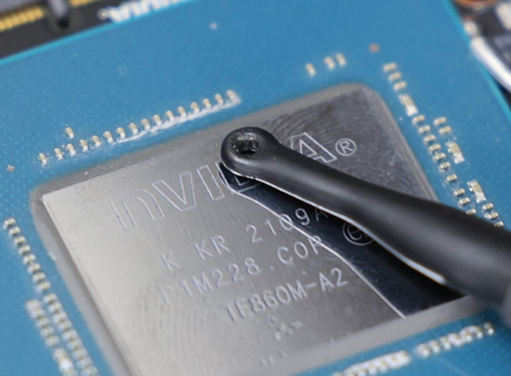
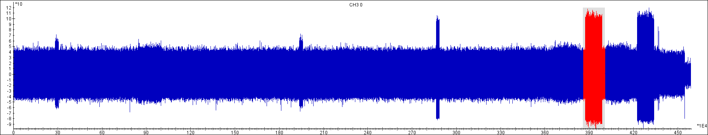
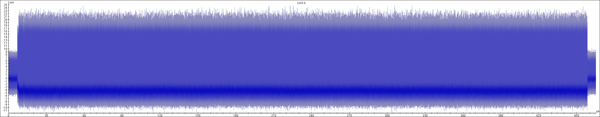
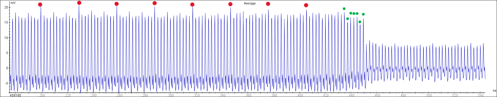
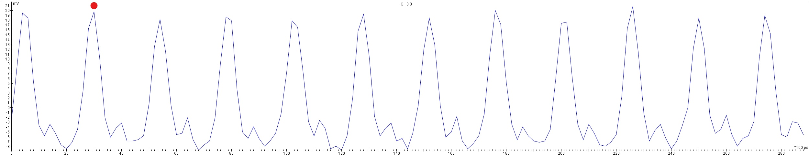
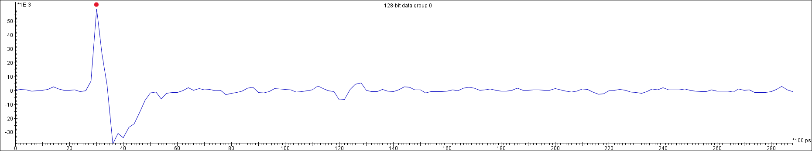

# EM Trace Acquisition Guide

## EM Signal Acquisition
To identify the optimal location for EM signal capture, multiple positions on the TOE were tested using probes of various shapes. The `Langer EMV RF-R 3-2` probe positioned at the location indicated in Figure below captured distinctive signals. These signals were closely correlated with the TOE's signature verification and firmware decryption operations.

## Oscilloscope Parameters

  |        Phase         | Sampling Rate | Bandwidth | Resolution | Duration | Vertical Resolution |
  | :------------------: | :-----------: | :-------: | :--------: | :------: | :-----------------: |
  | Preliminary Analysis |   250 MS/s    |  2.5 GHz  |   8-bit    | 18.5 ms  |    5 mV/division    |
  |   Real-World Attack   |    5 GS/s     |  2.5 GHz  |   8-bit    |  0.5 ms  |    5 mV/division    |

## Decryption Operations
Captured raw EM traces (18.5 ms @250 MS/s) were analyzed to identify the AES decryption window through distinct repetitive patterns. 
The red-marked segment (0.45 ms) in Figure below represents the firmware decryption process executed using the SBK. 
  

## AES Operational Characterization
The trace set `EM_Trace_SBK_Decryption.trs` in folder `Proof_of_Concept\EM_Trace` correspond to the electromagnetic signals captured when the TOE completed decryption using the SBK key.

Upon detailed analysis of the trace's zoomed segments (**averaging trace**), the unique "fingerprint" of each individual AES block decryption are clearly identifiable. 
The tall peaks marked in red (significantly higher than surrounding peaks) indicate the start of each decryption operation. 
A single AES-128 block decryption process consistently spans 12 clock cycles (see Figure below for zoom-scale visualization).

## Waveforms Extraction and Known-Key Correlation
Each AES-128 block decryption waveform must be extracted and assembled into a trace set to perform Correlation Power Analysis.

The validity of the leakage model can be confirmed using known-key correlation analysis when the encryption key is known.

- **Results**：
  - Peak correlation ρ=0.057 funded at the peak of the 2nd clock cycle (marked in red in Figure above, 128-bit correlation result).
  - Confirmed linear relationship between EM amplitude and $\Delta_{\text{R}^{(1)},\text{R}^{(2)}}$ magnitude.

