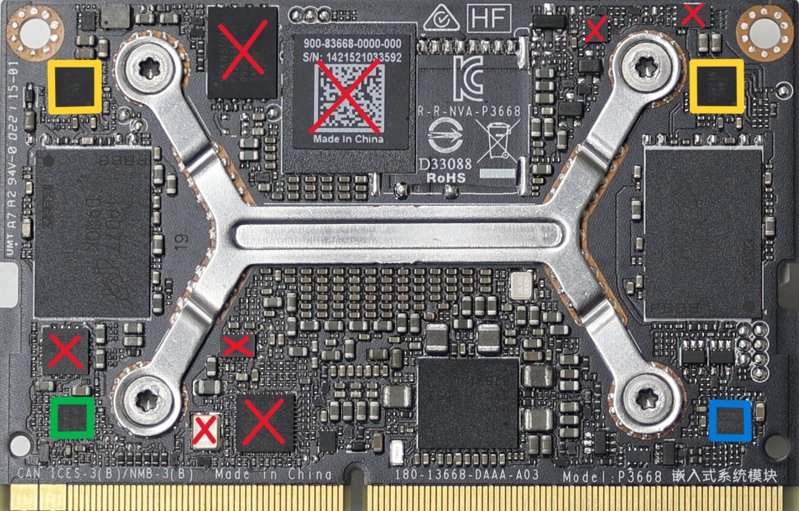
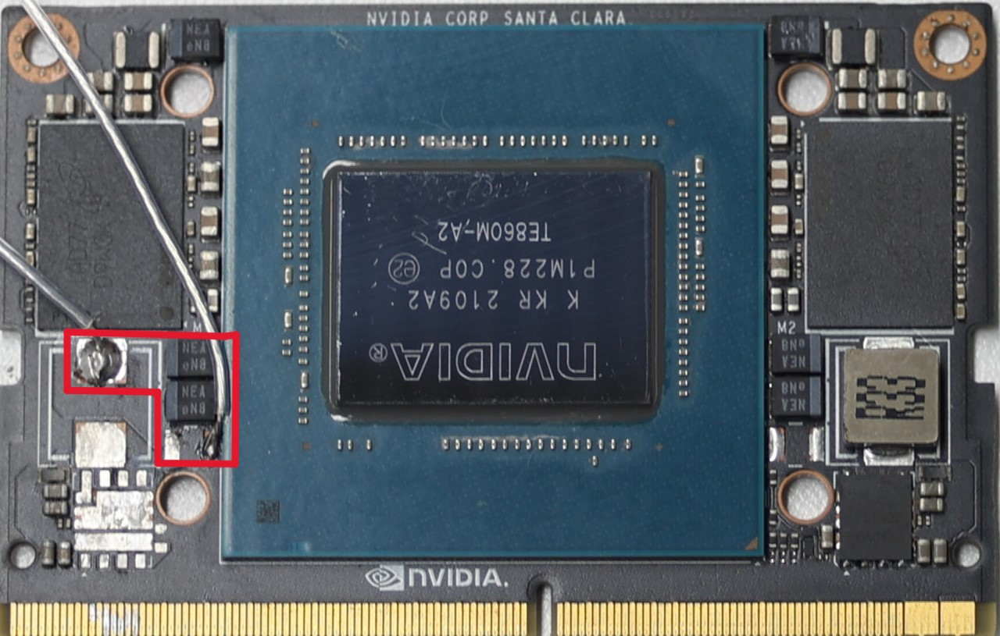

# Hardware Setup Guide
## Measurement Setup Introduction
This file describes the hardware modifications and measurement setup necessary to minimize system noise and capture electromagnetic (EM) signals effectively. The goal is to improve the signal-to-noise ratio (SNR) for precise side-channel analysis of the NVIDIA Jetson Xavier NX SOM during firmware decryption. The EM measurement setup was designed to capture transient electromagnetic signals generated during the decryption of the MB1 firmware. The following components and configuration were used:
1. **Target of Evaluation (TOE)**: NVIDIA Jetson Xavier NX SOM, connected to a modified carrier board.

2. **Power Supplies**: Two Agilent E3631A DC power supplies provided clean 5V (VDD_IN) and 0.85V (VDD_CORE) inputs.

3. **Electromagnetic Probe**: A Langer EMV RF-R 3-2 probe was used to capture EM signals.

4. **RF Amplifier**: A Mini-Circuits ZFL-1000LN+ amplifier was used to amplify weak EM signals.

5. **Oscilloscope**: A Lecroy 625Zi oscilloscope recorded the amplified signals.

6. **Embedded Development Board**: A Jetson-based kit bridges the workstation and TOE, handling USB data relay, SoC reset operations and oscilloscope trigger synchronization.

## Hardware Modifications for Low-Noise System
To minimize noise, non-essential components and their associated power ICs were removed. The following steps were taken:
- **Disable DRAM**: The power ICs (marked in yellow in Figure below) supplying 0.6V and 1.8V to the DRAM were removed.
- **Eliminate CPU/GPU Power IC**: The power IC responsible for the VDD_CPU_GPU rail (marked in green in Figure below) was removed.
- **Remove Additional Components**: Components such as level shifters, eMMC, Flash, Ethernet interface ICs, and power monitoring ICs were also removed (marked with red crosses in the left side of the image below).
- **Replace VDD_CORE Power Supply**: The DC-DC converter in the VDD_CORE rail associated with the Boot and Power Management Processor (BPMP) was replaced with a lower-noise power supply. A 0.85V input was directly supplied using an Agilent E3631A DC power supply (highlighted in the right side of the image below).

    
    

**Carrier Board Optimization**

The SOM requires a carrier board for 5V VDD_IN power supply and I/O interface extension. Noise-generating components on the carrier board were removed to further improve SNR:
- **Remove Non-Essential Components**: Only circuitry critical for basic SOM functions (e.g., USB communication, reset signal control, and RCM mode selection) was retained.
- **Optimize Power Delivery**: The original 5V power supply (VDD_IN) was replaced with a clean 5V input from an E3631A DC power source to eliminate switching noise.
