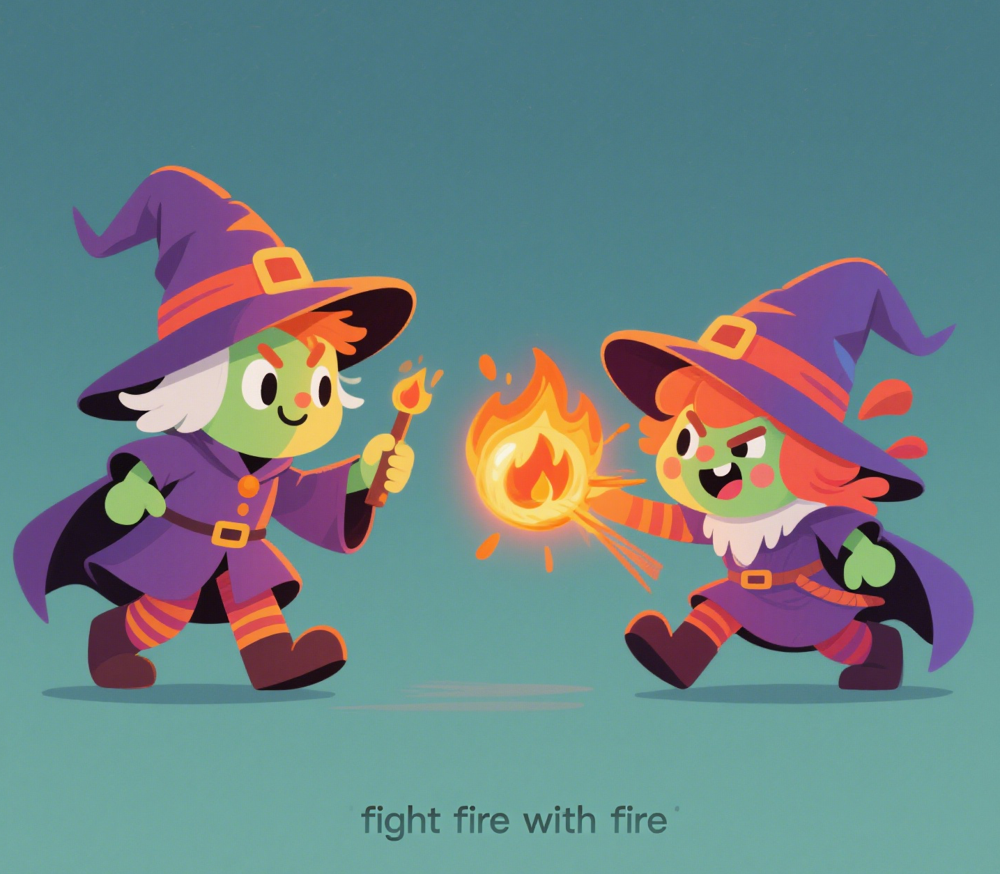

  

# Fight-Fire-with-Fire Attack
This repository contains the artifact for our paper "**Classical Attacks, Modern Targets:Side-Channel Compromises Secure Boot Key in NVIDIA Jetson Edge AI**" submited to NDSS 2026.

Our investigation uncovered **Fight-Fire-with-Fire Attack**, a novel and unpatchable vulnerability in the Nvidia Jetson Xavier NX SoC, which enabling `Secure Boot key (SBK)` and `Nvidia's MB1 Encryption Key (NV-MEK)` recovery through GPU-accelerated 32-bit correlation power analysis (CPA) within 10 hours.

This vulnerability has been reproduced and acknowledged by NVIDIA. In accordance with lawful vulnerability disclosure protocols, it has been assigned the CVE identifier **CVE-2025-286543**, and mitigation measures have been published. 

For details, refer to: <https://www.nvidia.com/en-us/security/>

## Structure Descriptions
This repository is structured as follows:

- **`Hardware_Setup`**: Contains the hardware setup guide for the EM acquisition framework, which enables efficient and low-noise EM signal acquisition.

- **`EM_Trace_Acquisition`**: Contains contains a guide for electromagnetic (EM) trace acquisition during the decryption of the MB1 firmware with SBK.

- **`Proof_of_Concept`**: Contains all scripts, CUDA source code, and EM trace datasets required to complete the Proof of Concept (PoC) validation.

## Reproduction Instructions
Since side-channel attacks (SCA) rely on sophisticated hardware equipment, please carefully review the contents in the `EM_Trace_Acquisition` and `Hardware_Setup` folders before attempting reproduction.

The `Proof_of_Concept` directory provides all components required to complete the PoC, including:

- Electromagnetic (EM) traces collected during our experiments
- CUDA-accelerated Correlation Power Analysis (CPA) implementation (source code)
- Result outputs (e.g., statistical reports and decrypted keys)

## Mitigation Recommendations
- **Immediate Actions**
  - ✅Disable RCM during seucre boot.
  - ✅ Inject noise during AES operations.

- **Long-Term Solutions**
  - ✅ Add random delay injection in Boot ROM. 
  - ✅ Redesign AES hardware module, Integrate masking or threshold implementation (TI) logic.

## Important Notes
- Our PoC exclusively demonstrates a 100%-confidence-rate recovery of the `Secure Boot Key (SBK)`.
  
- No implementation or data related to `Nvidia’s proprietary MB1 encryption key (NV-MEK)` is included here, as ownership of this key resides solely with Nvidia.
  
- Refer to the `README` in `Proof_of_Concept` directory for detailed instructions and dependencies.
  
- To prevent potential misuse of certain core code components, after completing the NDSS 2026 artifact evaluation process, we will not providing the source code of the GPU-accelerated 32-bit CPA attack implementation. Instead, we will release a compiled binary executable program to researchers.

## License
All the files within this repository is AGPL-3.0 licensed, as found in the LICENSE file.
